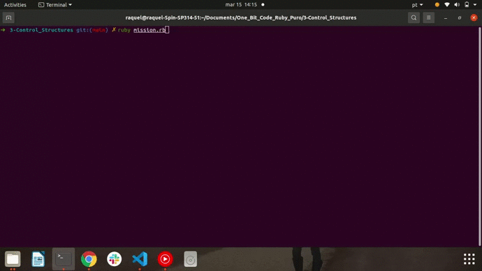

<h1> 🔭 What has been learned: </h1>

- Conditional: If/Else/Elsif; Unless; Case
- Iterations: For; While; Times; Do/While (Loop)
- Iteration + Conditional

 
 

- Mission: Using the iteration and condition structures, create a calculator that offers the user the option to Multiply, Divide, Add or Subtract two numbers. Do not forget to also allow the user to close the program.

