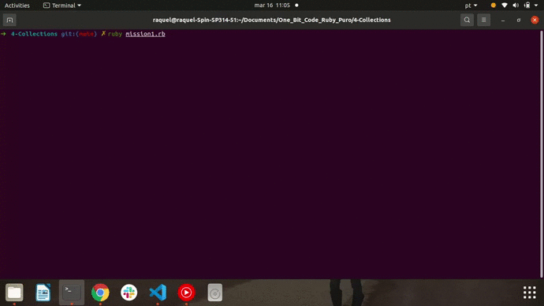
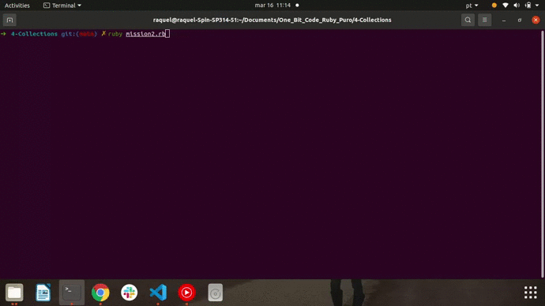
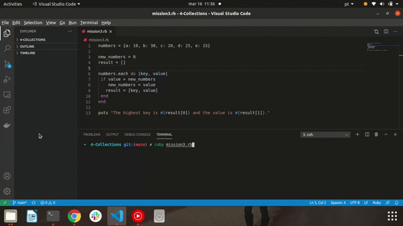

<h1> 🔭 What has been learned: </h1>

- Collection
- Manipulating Collections: Array; Hash
- Iterations

 
 

- Mission 1: Using an Array-type collection, write a program that receives 3 numbers and at the end displays the result of each raised to the second power.

 
 

- Mission 2: Create a collection of type Hash and allow the user to create three elements informing the key and the value. At the end of the program for each of these elements print the phrase “One of the keys is **** and its value is ****”

 
 
 

- Mission 3: Given the following hash: Numbers = {a: 10, b: 30 2, c: 20, d: 25, e: 15} Create an instruction that selects the highest value of this hash and at the end print the key and value of the resulting element.

 