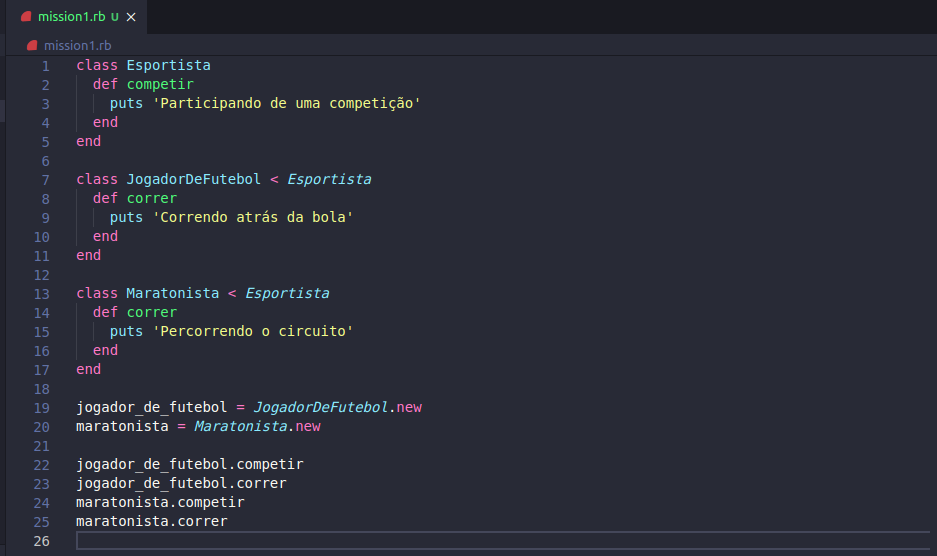
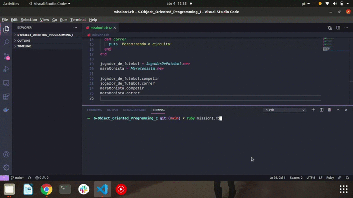

<h1> 🔭 What has been learned: </h1>

- OOP
- Object
- Class
- Classes in Ruby

 
 

- Mission 1: 

Create a program following this paradigm with:

Classes:
Sportsman - Methods: compete -> Print the message “Participating in a competition”

Football player - Methods run -> Print the message “Running after the ball”

Marathonist - Methods: run-> Print the message “covering the circuit”

 
The PlayerFootball and Marathoner classes must inherit the behaviors of the Sportsman class.

At the end of the program, run the methods of competing and running on objects of the PlayerFootball and Marathon type.

 
 

 

