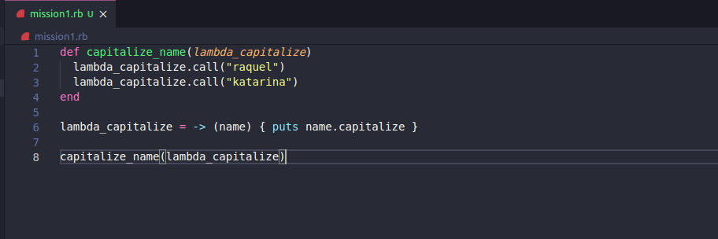
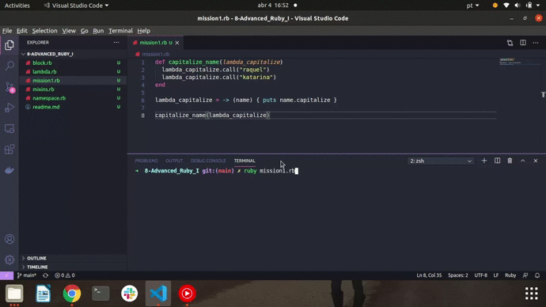
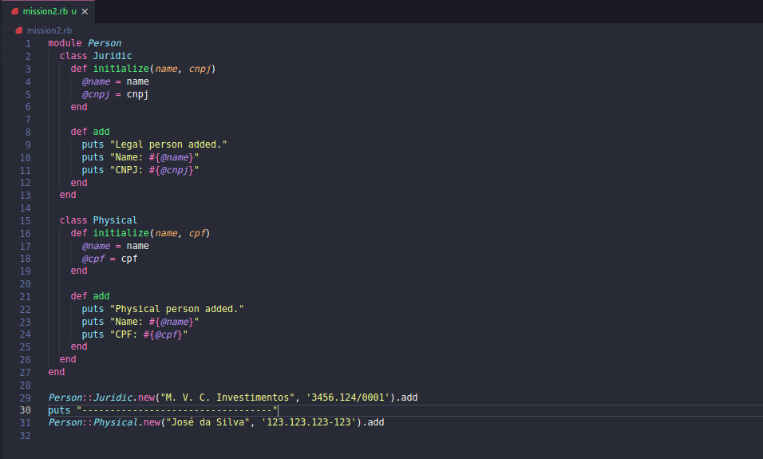
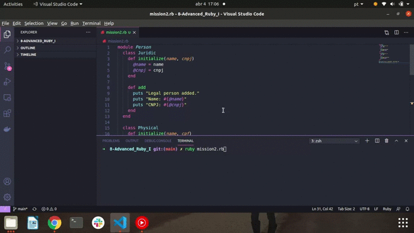

<h1> 🔭 What has been learned: </h1>

- Blocks
- Lambdas
- Modules – Namespaces
- Modules – Mixins

 
 

- Mission 1: Ruby offers a method called capitalize to capitalize the first letter of a string.

Knowing this, create a lambda that takes a name as a parameter and prints it with the first capital letter. This lambda must be saved inside a variable that will be passed as an argument to a method called capitalize_name.

Within this method you will call the lambda twice, passing a different name as a parameter in each of them.

 

 

 
 

- Mission 2: Create a module called Person with the Juridic and Physical classes.

When executing the instruction: Person::Juridic.new('M. C. Investimentos', '4241.123/0001').add

And with the instruction: Person::Physical.new('José Almeida', '425.123.123-123').add

 

 

 
 

- Mission 3: Search for what Proc is in Ruby and find out the differences between it and Lambda

<i>"Procs are not methods, they are pieces within the code, so when it returns it is the return of the proc_return method, and it does just that. However, lambdas act as methods, checking the number of arguments and not overriding the return methods." </i>

