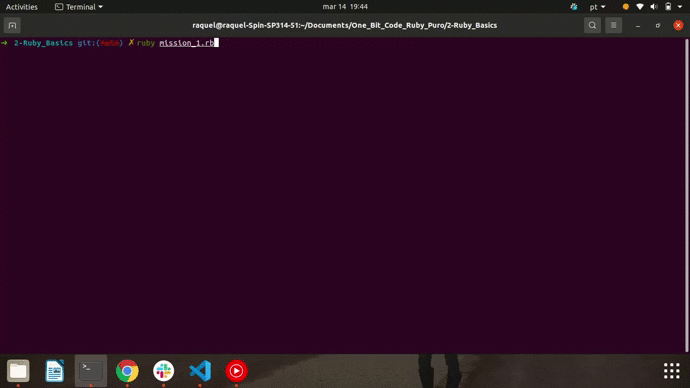
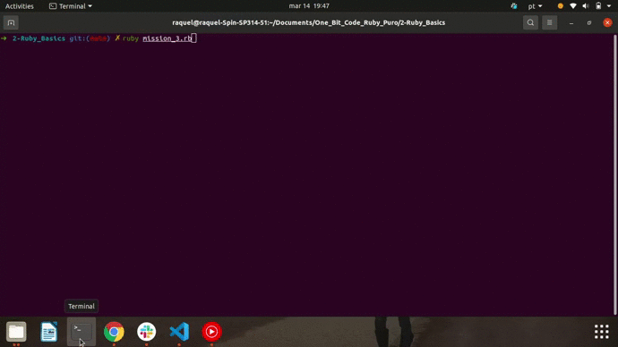

<h1> 🔭 What has been learned: </h1>

- Types of data: Integer; Float; Boolean; String; Array; Symbol and Hash.
- Mathematical Operators
- Puts/gets

 
 

- Mission 1: In Irb, create all the main types of data mentioned in the class with different values ​​from the examples.

 
 

- Mission 2: Create a program that receives a person's name and age and at the end displays these two data in a single sentence.

 
 

- Mission 3: Create a program that receives two integers and at the end displays the sum, subtraction, addition and division between them.

