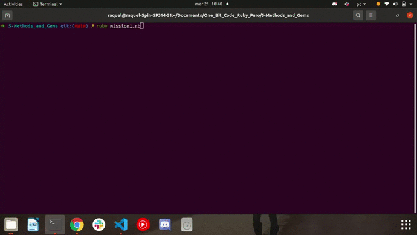

<h1> 🔭 What has been learned: </h1>

- How to create methods
- What they are and how to use Gems

 
 

- Mission 1: Create a program that has a method that solves the power given a base number and its exponent. These two values ​​must be informed by the user.

 
 

- Mission 2: Follow the cpf_cnpj gem documentation to create a program that receives a cpf number as input and in a method check that this number is valid.

 