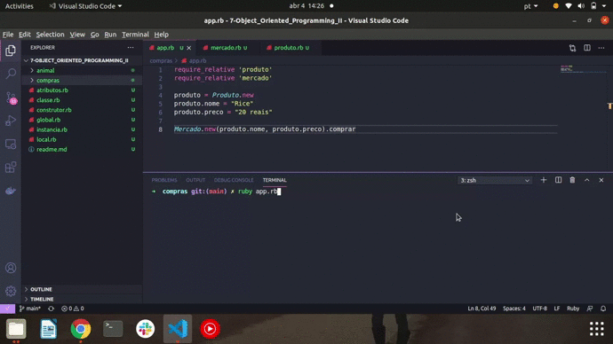

<h1> 🔭 What has been learned: </h1>

- Require
- Scope of variables: Local Variable; Global Variable; Class Variable; Instance Variable
- Attributes
- Builders

 
 

- Mission 1: Create a project called Purchasing with the following structure: folder: compras with files: app.rb, mercado.rb and produto.rb 

This project will simulate the act of choosing and buying a product in a market.

Project instructions:

1- In the product.rb file, create a class called Product with the attributes: name and price.

2- In the market.rb file, create a class called Market which, when initialized, receives an object of the Product class as an attribute.

3 - Within the class, create a method called buy that prints the following phrase "You purchased the product #{@produto.nome} in the value of #{@produto.preco}"

4- In the app.rb file, create an instance of the Product class and add values ​​to the name and price attributes. Then, start an instance of the Market class by passing a product object as an attribute and to finish, execute the buy method.

 
 

