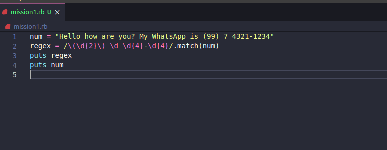
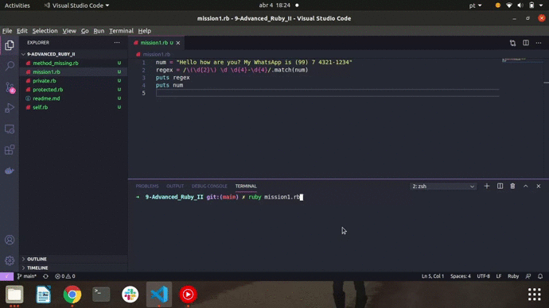
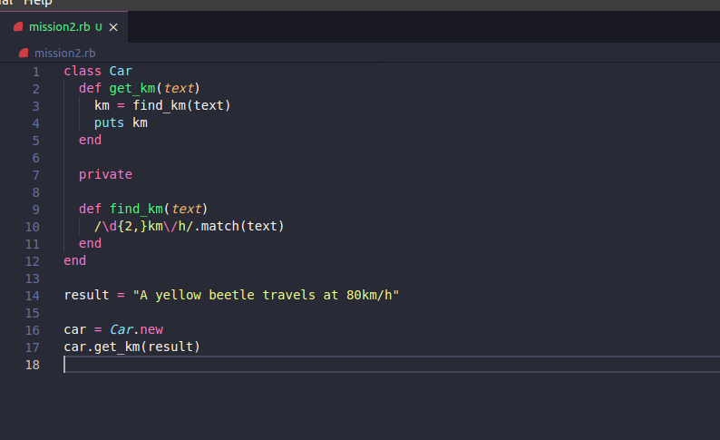
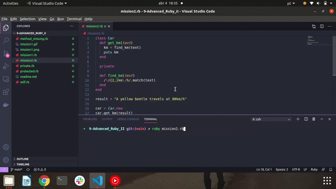

<h1> 🔭 What has been learned: </h1>

- Regex
- Math
- Time
- Method Missing
- Self
- Private and Protected

 
 

- Mission 1: Create a regular expression that matches the pattern with the phone number in the following text.

"Hey how is everything? My whats app is (99) 7 4321-1234 ”

 

 

 
 

- Mission 2:In a class called Car, create a public method called get_km that receives as a parameter the following information “A yellow beetle travels at 80km / h”.

The get_km method must call a private method with the name find_km. This should locate and return the 80km / h pattern marriage.

At the end, print this return.

 

 

